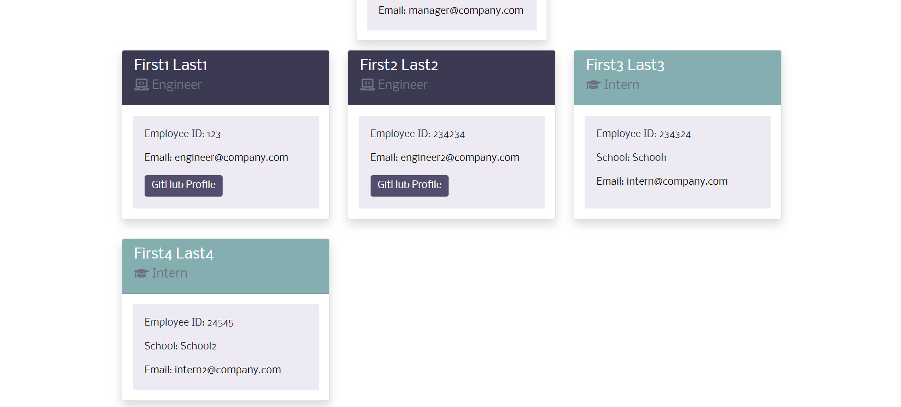

# Team_Profile_Generator
 

## Description
The Team Profile Generator allows a user to build their team and create an easy to navigate HTML page that contains each team members position, name, and contact information. The app allows you to first input the team's manager, and then build engineers and interns until your team is complete.

## Table of Contents
  - [Description](#description)
  - [Installation](#installation)
  - [Usage](#usage)
  - [License](#license)
  - [Testing](#testing)
  - [Contributions](#contributions)  
  - [Questions and Contact](#questions-and-contact)
  - [Credits](#credits)

## Installation
- To install this application, first clone to repo to your local device.
- Make sure to install node.
- Run ***npm install inquirer***
- Run ***npm install jest***

Inquirer will be used to generate questions to take in the user input for building the team. Jest is used to test that the employee, engineer, manager, and intern classes were built correctly.

## Usage
This app is to build an HTML page displaying your work team. Run the app using node in the bash terminal by typing the command ***node index.js***.
Follow the question structure by hitting enter on the type of employee you want to add and typing in the information for that person before moving to the next employee. When you are finished adding, select the ***I'm done building my team!*** option to generate your HTML page. You will be prompted to type in a file name. The file will be generated in the ***dist*** folder, where there is already a designated css styling file. 

## License
  
  This application is licensed under the MIT license. Please click the link to read more about the license! 
  [License Information](https://choosealicense.com/licenses/mit/)

## Testing
This application uses jest testing. Please see the _test_ folder for the jest tests that were built. Use ***npm test*** command to run the tests when you are in the test directory in the terminal.

## Contributions
:busts_in_silhouette: 
If you wish to contribute, please feel free to open an issue so we can discuss your ideas and develop a plan to move forward!
Pull requests will not be accepted without prior discussion, thank you. 

## Questions and Contact
  :grey_question::grey_question: 
  Please visit my GitHub profile  
  :octocat: https://github.com/aanolan51   
  Feel free to drop me a line!   :fountain_pen: nolana464@gmail.com
 

## Credits:
1. https://www.codota.com/code/javascript/modules/inquirer
2. https://stackoverflow.com/questions/10058814/get-data-from-fs-readfile
3. https://nodejs.dev/learn/how-to-exit-from-a-nodejs-program
4. https://developer.mozilla.org/en-US/docs/Web/JavaScript/Reference/Global_Objects/String/split
5. https://jestjs.io/docs/expect#expectstringcontainingstring